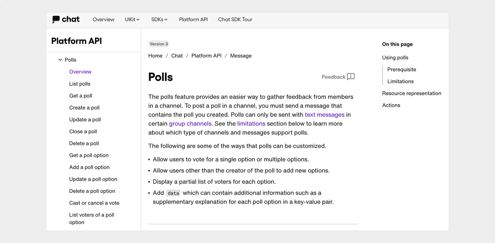
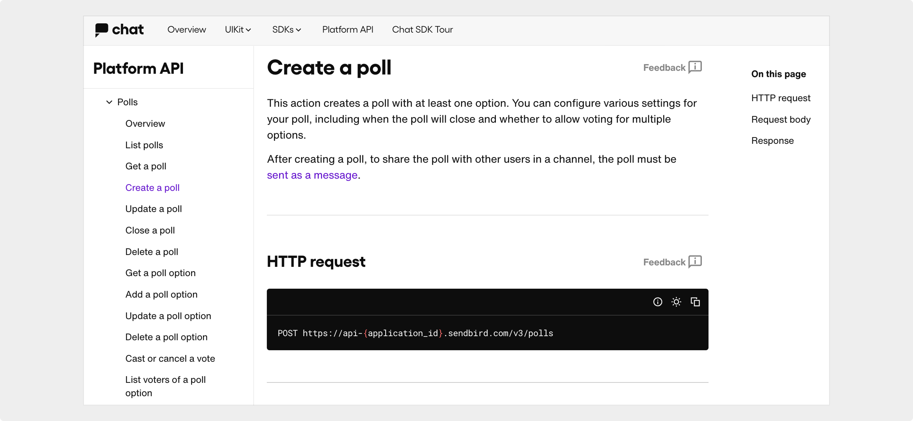

# API reference for Polls

  

Sendbird  |  Summer 2022 

## About the project

Sendbird, a leading B2B chat platform, introduced a new feature called Polls which enables participants to create and vote in polls directly within conversations, making in-chat interactions more engaging. 

I was the sole technical writer for this project in a cross-functional team that included backend and SDK engineers, a product designer, and a product manager. 

## My tasks

I was responsible for the following documentation deliverables, all released in sync with the feature launch:
- Code naming review
- API reference documentation
- SDK documentation for iOS, Android, and JavaScript

:::info[Work scope]
All content was written by me, except for the code samples.
:::

### Code naming review

I started by consulting internal specifications to understand both the user-facing and technical aspects of the Polls feature. I collaborated with engineers to review and refine customer-facing code names, such as endpoints, resource properties, and SDK methods, to ensure clarity and consistency with other Sendbird products.

### API reference

The API reference included two main parts: a [feature overview page](https://sendbird.com/docs/chat/platform-api/v3/message/polls/polls-overview) and detailed documentation for 12 actions, such as [listing polls](https://sendbird.com/docs/chat/platform-api/v3/message/polls/list-polls), [creating a poll](https://sendbird.com/docs/chat/platform-api/v3/message/polls/create-a-poll), and [updating a poll option](https://sendbird.com/docs/chat/platform-api/v3/message/polls/update-a-poll-option).

In the overview, I provided concise explanations of the feature's purpose, prerequisites, and key functionality to help developers understand and implement it quickly.

For each action, I wrote clear and accurate descriptions of endpoints, parameters, request/response formats, and error handling. I worked closely with the backend team to ensure the documentation matched the final implementation. 

### SDK documentation

Based on the API reference, I created platform-specific guides for iOS, Android, and JavaScript developers. 
These platform-specific guides focused on practical integration steps, complete with code snippets from the engineering team to support real-world implementation.

## Outcome 

I successfully launched the API and SDK docs in alignment with the feature release, enabling developers to integrate Polls with ease.

This project demonstrated my ability to take ownership of end-to-end documentation for a newly launched product feature. By aligning closely with engineers and product stakeholders, I ensured the documentation was technically accurate, easy to navigate, and consistent across platforms. 
