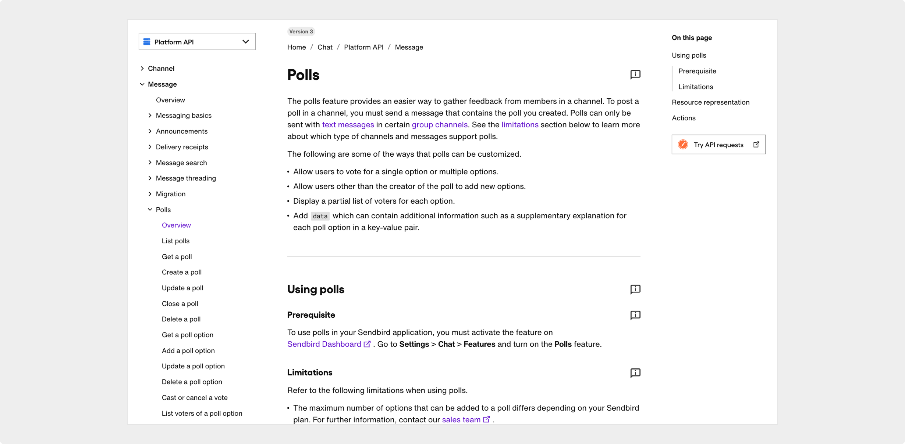

import ViewProjectBtn from '@site/src/components/ViewProjectBtn'

# API reference

Sendbird  |  October 2022 

  

## Project overview

As a technical writer at Sendbird, a leading B2B chat platform, I documented a new feature called Polls, which enables users to create and vote in polls directly within chat conversations. 

<ViewProjectBtn url="https://sendbird.com/docs/chat/platform-api/v3/message/polls/polls-overview">View Project -></ViewProjectBtn>

Read the [Polls feature overview](https://sendbird.com/docs/chat/platform-api/v3/message/polls/polls-overview) and samples of the API reference guides, such as [list polls](https://sendbird.com/docs/chat/platform-api/v3/message/polls/list-polls), [create a poll](https://sendbird.com/docs/chat/platform-api/v3/message/polls/create-a-poll), and [update a poll option](https://sendbird.com/docs/chat/platform-api/v3/message/polls/update-a-poll-option). 

*Note: All content was written by me, except for the code samples.*

My responsibilities consisted of the following:

- Wrote a comprehensive feature overview and 12 API reference guides for supported actions.
- Ensured technical accuracy by collaborating closely with engineers and product stakeholders and by using Postman to test API endpoints and validate request/response behavior.

## Outcome

- Deployed the documentation in sync with the feature release, contributing to a smooth developer onboarding experience.
- Led the end-to-end documentation process, from draft to release, maintaining clarity, accuracy, and alignment with company standards.

