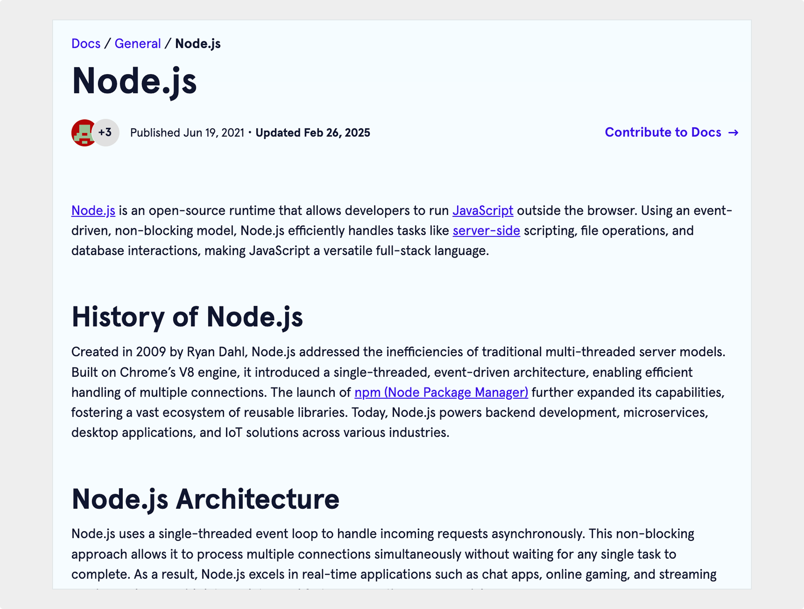

import InteractiveButton from "@site/src/components/InteractiveButton";

# Concept explainer

Codecademy | February 2025

  

## Project overview

I contributed to Codecademy’s open-source documentation by writing a concept explainer for Node.js.

<InteractiveButton url="https://www.codecademy.com/resources/docs/general/node-js">
	View Project →
</InteractiveButton>

_Note: All content was written by me._

## Scope of work

- Researched and synthesized information about Node.js, including its origin, architecture (event loop, non-blocking I/O), and how it differs from traditional server-side environments.
- Explained technical concepts in plain language to ensure accessibility for readers of all skill levels.
- Organized content to follow Codecademy’s guidelines for SEO, style, and structure.

## Outcome

- Delivered foundational knowledge about the history, architecture, advantages, and limitations of Node.js in a clear and engaging way.
- Highlights practical applications and use cases where Node.js excels, helping readers understand when and why to use Node.js.

