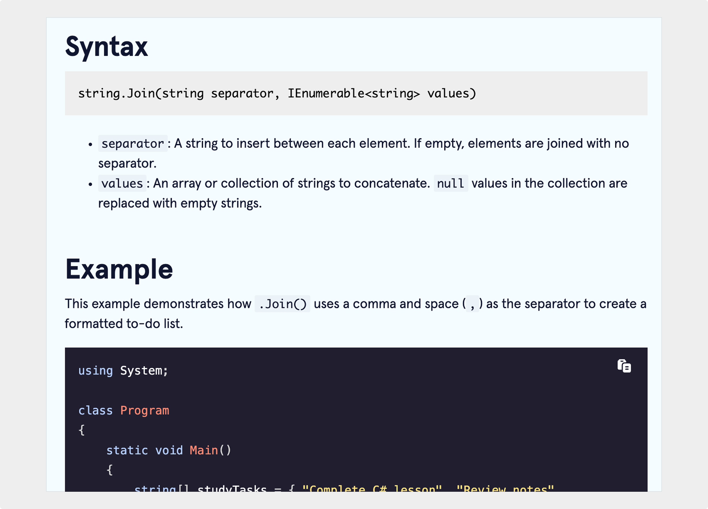

import InteractiveButton from "@site/src/components/InteractiveButton";

# Method terminology

Codecademy | December 2024

  

## Project overview

I contributed to Codecademy's open-source documentation by creating a terminology entry for the `.Join()` method in C#.

<InteractiveButton url="https://www.codecademy.com/resources/docs/c-sharp/strings/join">
	View Project →
</InteractiveButton>

_Note: All content was written by me._

## Scope of work

- Wrote a clear, concise description of the `.Join()` method's purpose and syntax.
- Included practical code examples showing how to join string arrays using different delimiters.
- Organized content to follow Codecademy's guidelines for SEO, style, and structure.

## Outcome

- Enabled readers to quickly understand the `.Join()` method by providing a straightforward definition and self-explanatory examples.
- Contributed to Codecademy Docs' mission to provide reliable, beginner-friendly programming references.

