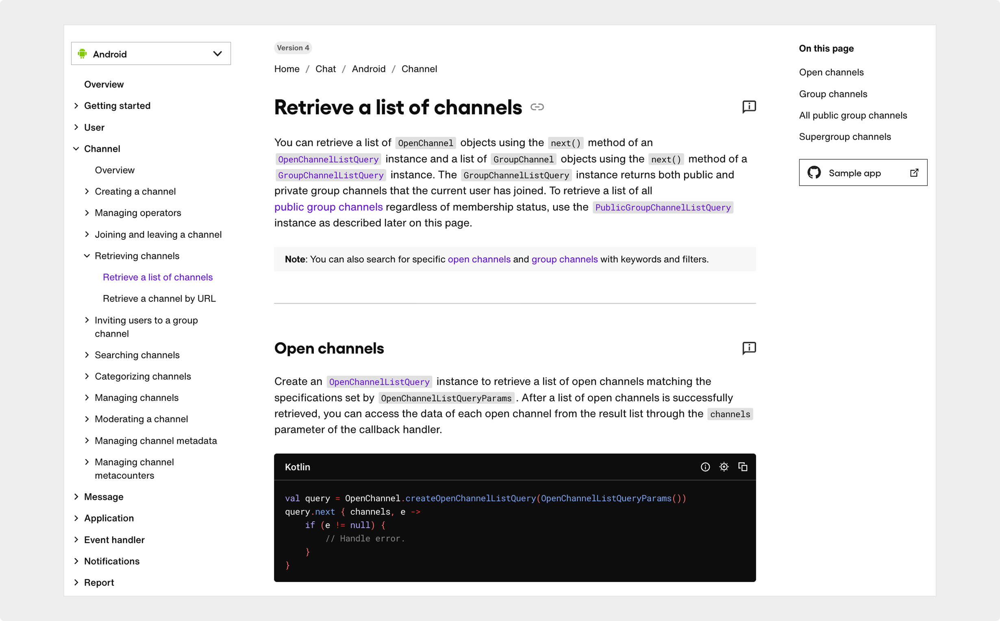

import InteractiveButton from "@site/src/components/InteractiveButton";

# SDK documentation

Sendbird | June 2022

  

## Project overview

As a technical writer at Sendbird, a leading B2B chat platform, I maintained and improved the Chat SDK documentation to support developers integrating chat features across multiple platforms.

<InteractiveButton url="https://sendbird.com/docs/chat/v4/android/channel/retrieving-channels/retrieve-a-list-of-channels">
	View Project →
</InteractiveButton>

_Note: All content was written by me, except for the code samples._

## Scope of work

- Rewrote an existing SDK documentation to clarify the different methods of resource retrieval based on its type.
- Partnered with engineers to improve code snippets to include a more helpful example.
- Incorporated feedback from internal teams and external users to address common questions and align the content with real-world use cases.

## Outcome

- Improved documentation clarity, reducing confusion around complex behavior.
- Contributed to more robust sample code, making implementation easier for developers.

