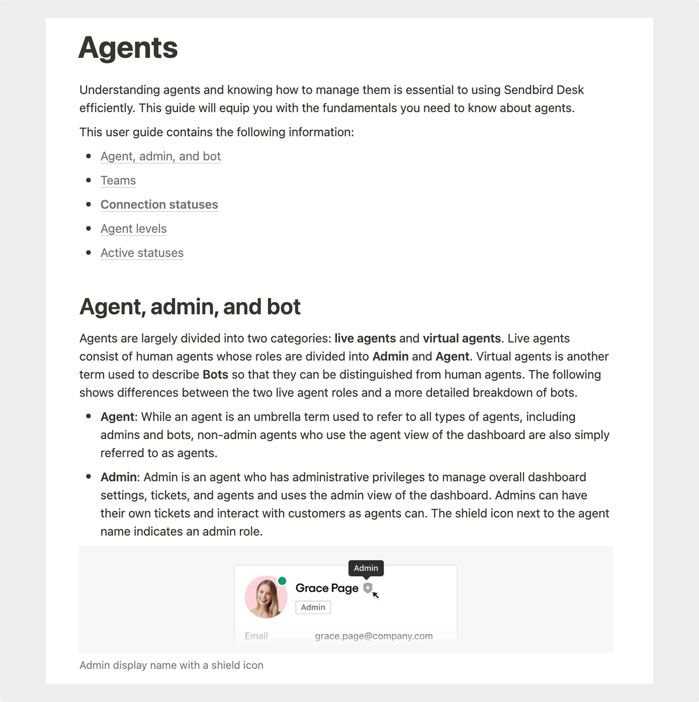

import InteractiveButton from "@site/src/components/InteractiveButton";

# User guide

Sendbird | March 2022

## Project overview

As a technical writer at Sendbird, a leading B2B chat platform, I created a user guide covering all functions of the Agent feature in Sendbird’s Desk product.

<InteractiveButton url="https://www.notion.so/Agents-b56e36237e0e42bebc39aa9d173e1da6">
	View Project →
</InteractiveButton>

_Note: All content was created by me, except for the final images, which were based on drafts I provided._

# Scope of work

- Developed a comprehensive guide that provides helpful knowledge and instructions.
- Collaborated with a product designer to create visuals that enhance understanding and usability.

## Outcome

- Delivered a centralized knowledge base for support agents using the Desk dashboard, improving onboarding and reducing repetitive support inquiries.
- Fostered alignment across teams by clarifying agent-related terminology and designing a clear, hierarchical information structure that guides users through each aspect of the feature.

