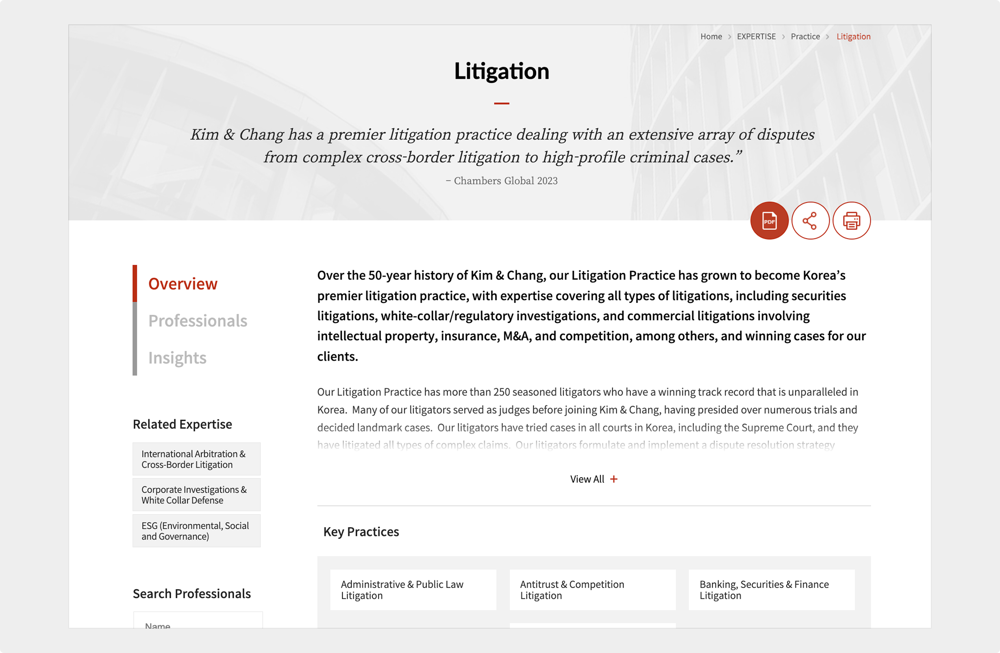

import InteractiveButton from "@site/src/components/InteractiveButton";

# UX writing

Kim & Chang | February 2020

 

## Project overview

As the content editor at Kim & Chang, Korea’s leading law firm, I led the UX writing and content strategy for a full website revamp.

<InteractiveButton url="https://www.kimchang.com/en/expertise/view/litigation">
	View Project →
</InteractiveButton>

_Note: All content in the above page was written or edited by me. Other pages of the website have been modified since my time at the firm._

## Scope of work

- Wrote and edited copy for key pages, including service descriptions, bios, and navigation menus, with a focus on clarity, accessibility, and professionalism.
- Localized content based on Korean source copy, adapting language and tone to suit an international audience while maintaining fidelity to the original meaning.

## Outcome

- Delivered a seamless content experience that better supported international clients and prospects.
- Reinforced the firm’s credibility and global image through clear, consistent, and brand-aligned language.

